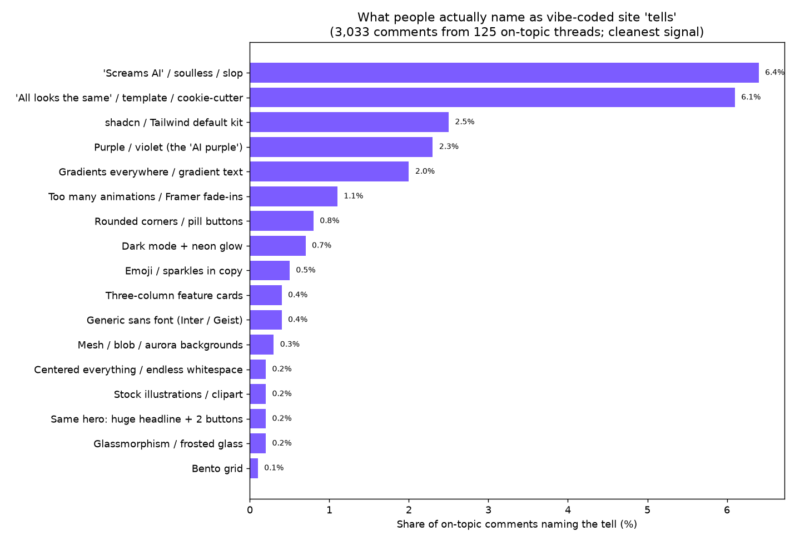
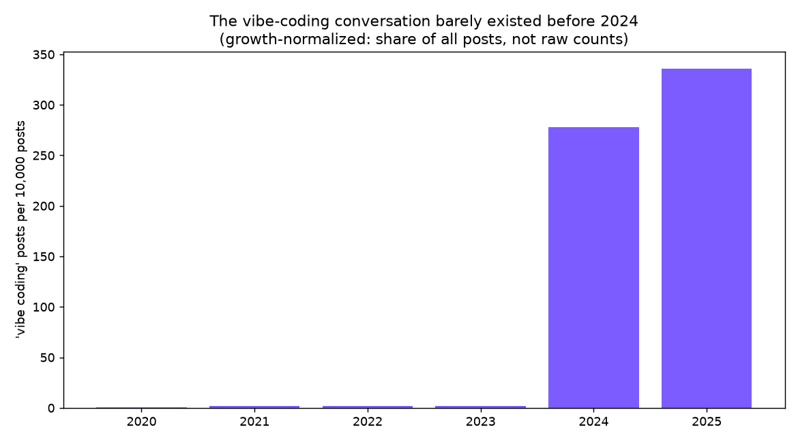
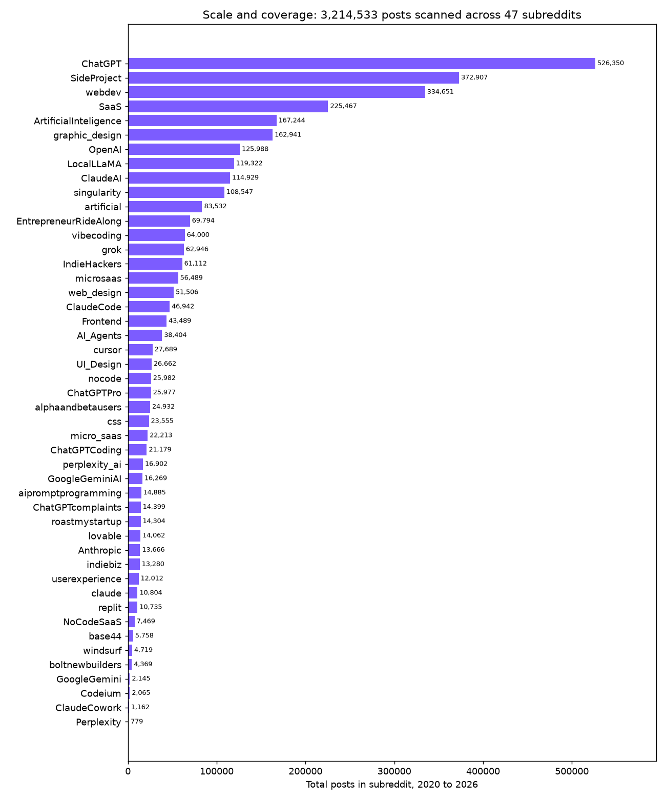

# What makes a site look "vibe-coded": the data

This repo is the full dataset and code behind a Reddit post that ranked the visual "tells" people use to spot AI-built (vibe-coded) websites. It mines public Reddit discussion from the free [Arctic Shift](https://arctic-shift.photon-reddit.com) archive, tabulates which design features get named most, and verifies the findings against real quotes.

Everything here is reproducible with Python and the standard library plus matplotlib. No API key, no auth.

## The numbers

- **3,214,533 posts scanned** across **47 AI and SaaS subreddits**, 2020 to 2026.
- **46,971** of those are on-topic (about AI-built sites), 1.46% of the scanned base.
- **3,033** comments harvested from **125 canonical threads** ("why do AI sites all look the same", "dead giveaways for AI slop websites", and similar). These comments are the cleanest signal because they are 100% on-topic.
- Every top tell was adversarially verified by an independent pass. 11 of 12 held up; one ("mesh / blob / aurora backgrounds") was rejected as a keyword artifact.

## Headline finding

The loudest complaint is not any single feature. It is that the sites are recognizable on sight. "They all look the same" and "screams AI / slop" each show up in about 13% of on-topic posts. Among specific features, the ranking by share of on-topic comments is:



shadcn/Tailwind defaults and the "AI purple" gradient lead. The stereotypical Twitter memes (bento grids, glassmorphism, aurora gradients) sit near the bottom or get rejected.

## Why now

The conversation barely existed before 2024. Measured as share of posts (not raw counts, which just track subreddit growth), it jumped roughly 150x from 2023 to 2024.



## Scale and coverage



## The skill

The same findings are packaged as `unslop-ui`, a Claude skill that flags and removes
these patterns while building or auditing a site. It includes a standalone scanner
(`skill/scripts/devibe_scan.py`) that greps a codebase and prints findings with a vibe
score, usable on its own or in CI. See [skill/README.md](skill/README.md) to install it
or run the scanner.

## How to reproduce

Run in this order. Each script is sequential and resumable (the harvesters checkpoint and dedupe by id), and writes its outputs into this folder.

```bash
pip install -r requirements.txt

python3 collect.py            # Phase 1-2: per-sub totals + matched-by-year (aggregate endpoint)
python3 harvest.py 3000       # Phase 3: harvest on-topic post text -> corpus.jsonl
python3 harvest_comments.py   # comments from the canonical threads -> comments.jsonl
python3 analyze.py            # post-level tell tabulation + the first five charts
python3 analyze_comments.py   # comment-level tell tabulation (the cleaner ranking)
python3 make_charts.py        # honest comment-level + comparison charts
python3 make_charts2.py       # scale, raw counts, funnel, concentration, co-occurrence, sentiment, threads
```

The committed `corpus.jsonl.gz` is a snapshot. To run the analysis scripts against it without re-harvesting, `gunzip corpus.jsonl.gz` first. `post_workflow.js` is the multi-agent verification and drafting workflow used to vet the tells.

## What is in here

- **Scripts:** `collect.py`, `harvest.py`, `harvest_comments.py`, `analyze.py`, `analyze_comments.py`, `make_charts.py`, `make_charts2.py`, `post_workflow.js`.
- **Raw data:** `corpus.jsonl.gz` (46,971 posts), `comments.jsonl` (3,033 comments). Fields: id, subreddit, created_utc, score, title/selftext or body, permalink. No usernames were collected.
- **Tables:** `comment_tell_counts.csv` and `tell_counts.csv` (the rankings), `scanned_totals_by_sub.csv`, `totals_by_year.csv`, `matched_by_year.csv`, `growth_by_year.csv`, `tell_share_by_year.csv`, `harvest_ledger.csv`, `summary.txt`.
- **Quote banks:** `tell_examples.md` and `comment_tell_examples.md` (verbatim quotes with permalinks).
- **Charts:** twelve PNGs.
- **`DATA_AND_GRAPHS.md`:** the full master table, growth table, and chart index.

## Method and caveats

Share of posts or comments, not raw counts. A tell that recurs across many threads ranks above one that spikes in a single viral thread. Tells are detected with a synonym lexicon (see `analyze.py`), counted over a design-context subset of the corpus, and the comment-level numbers are treated as the primary ranking because those threads are all on-topic.

This is a proxy for vocal, online opinion, so trust the relative ordering more than the exact percentages. Small subreddits are noisy, and keyword matching can miss sarcasm or catch the wrong sense of a word. See `DATA_AND_GRAPHS.md` for the per-tell false-positive notes.

## License

Code is MIT (see `LICENSE`). The harvested text is public Reddit content collected via Arctic Shift and belongs to its original authors; see `DATA_NOTE.md`.
