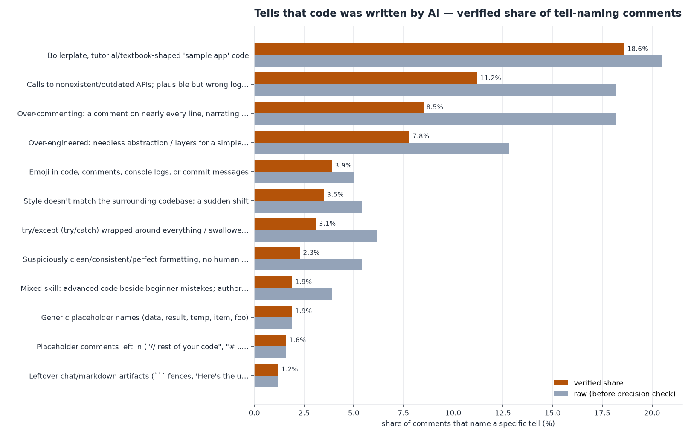
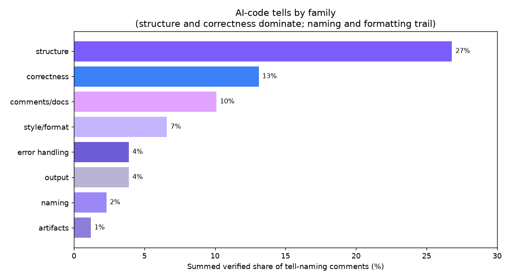
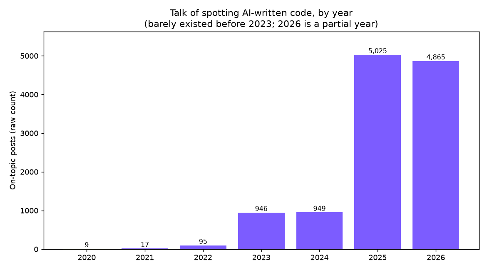

# What makes code look AI-written: the data

This repo is the full dataset and code behind a Reddit post that ranks the tells
people actually use to spot AI-written **code** (not AI text, not AI design, the
code itself). It mines public Reddit discussion from the free
[Arctic Shift](https://arctic-shift.photon-reddit.com) archive, classifies which
code-level tells get named most, and adversarially verifies every top finding
against the real quotes.

Reproducible with Python and the standard library, plus matplotlib for charts and
an LLM pass for the classification. No API key for the data (Arctic Shift is open).

## The numbers

- **11,906 on-topic posts + 11,306 comments** from **353 canonical threads**,
  across **55 subreddits**, 2020 to 2026.
- Three lanes, on purpose: **AI assistants / coding-agent tools** (r/ChatGPTCoding,
  r/ClaudeAI, r/cursor, r/GithubCopilot, r/LocalLLaMA, ...), **language & craft subs**
  (r/programming, r/ExperiencedDevs, r/rust, r/Python, r/webdev, r/codereview,
  r/cscareerquestions, ...), and **SaaS / indie** (r/SaaS, r/SideProject, ...).
- **2,136 candidate comments + 1,500 candidate posts** were classified by an LLM
  into a fixed taxonomy of 19 code-level tells, because keyword counting cannot
  read diffuse natural language (it either misses everything or matches every code
  block with a backtick).
- **Every top tell was adversarially verified**: an independent pass re-read the
  quotes tagged with each tell and discarded the misattributed ones. One tell
  ("leftover debug logging") was rejected outright as a keyword artifact; several
  others ("over-commenting", "verbose naming") were precision-discounted.

## Headline finding

The loudest signal is not a feature. It is that AI code **looks like a tutorial**:
boilerplate, textbook patterns, a one-page app with dummy data. That plus a
near-as-loud "you can just tell, it's too generic" lead everything. Among specific
tells, the verified ranking (share of the comments that name a specific tell) is:



The real giveaways are about **shape and substance** (boilerplate, hallucinated
APIs, over-engineering, ignoring the codebase), not the cosmetic stuff the memes
fixate on (emoji, robotic names, a comment on every line). Rolled up by category,
structure and correctness dominate; naming and formatting trail.



## Why now

The conversation barely existed before 2023, then jumped almost vertically in 2025.



## The skill

The findings are packaged as `unslop-code`, a Claude skill that strips these tells while
writing or auditing code. It does not write the code for you and it has no preferred style. It
removes the mechanical surface tells (chat artifacts, placeholder comments, emoji, swallowed
errors, narrating comments, generic placeholder names) and points you at the structural tells a
linter passes: boilerplate, hallucinated APIs, over-engineering, and code that ignores the
surrounding repo. It includes a standalone multi-language scanner
(`skill/scripts/unslop_code_scan.py`) that flags the surface tells with severity weighted by the
verified shares, prints a slop score, and gates CI on the exit code. See
[skill/README.md](skill/README.md) to install it or run the scanner.

## How to reproduce

Run in this order. The harvesters are sequential and resumable (they checkpoint
and dedupe by id) because the Arctic Shift throttle is sticky and concurrency
corrupts results.

```bash
pip install -r requirements.txt

python3 collect.py 280            # harvest on-topic posts -> corpus.jsonl (re-run until ALL-DONE)
python3 denom.py 300              # best-effort per-sub denominators -> totals_by_year.csv
python3 harvest_comments.py 280   # comments from the canonical threads -> comments.jsonl (re-run to finish)

python3 prefilter.py              # build candidates.jsonl (tell-bearing comments)
python3 prep_posts.py             # build candidates_posts.jsonl (tell-bearing post sample)

# the key step: LLM classify into the taxonomy, then adversarially verify the top tells.
# run via the Claude Code Workflow tool against classify_workflow.js; it writes the
# return JSON, which you save as workflow_output.json.
python3 finalize.py               # verified ranking + quote bank from workflow_output.json
gunzip -k corpus.jsonl.gz         # recover the raw corpus the charts read
python3 make_charts2.py           # the twelve charts (purple house style)
```

The committed `corpus.jsonl.gz` is a snapshot, so `gunzip -k corpus.jsonl.gz` is enough to
make the charts without re-harvesting.

`analyze.py` / `analyze_comments.py` / `calibrate.py` are the regex first pass.
They are kept for transparency: they are what showed the keyword approach was too
brittle for this topic (camelCase tokens and stray backticks blow it up), which is
why the LLM classification + verification step exists.

## What is in here

- **Harvest:** `collect.py`, `denom.py`, `harvest_comments.py`.
- **Classify + verify:** `prefilter.py`, `prep_posts.py`, `classify_workflow.js`
  (LLM taxonomy classification of every candidate + an adversarial verifier per top
  tell), `finalize.py`.
- **Regex first pass (kept for transparency):** `analyze.py`, `analyze_comments.py`,
  `calibrate.py`.
- **Charts:** `make_charts2.py` and the twelve PNGs (see the chart index below).
- **Raw data:** `corpus.jsonl` (11,906 posts), `comments.jsonl` (11,306 comments).
  Fields: id, subreddit, created_utc, score, num_comments, title/selftext or body,
  permalink. No usernames. See `DATA_NOTE.md`.
- **Tables:** `final_tell_counts.csv` (the verified ranking with raw share,
  precision, verdict, and verified share), `final_quote_bank.md`, `final_summary.txt`.
- **The post:** `AI Code Tells Reddit Post FINAL.md`.

### Charts

Twelve PNGs, built by `make_charts2.py` in the design study's purple house style:
`chart_verified_ranking.png` (the verified, precision-adjusted ranking), `chart_raw_vs_verified.png`
(how much the precision check moved each tell), `chart_tells_ranked.png` (the raw LLM
classification), `chart_post_vs_comment.png`, `chart_by_category.png`, `chart_growth_byyear.png`,
`chart_tell_trend.png`, `chart_scanned_by_sub.png`, `chart_raw_counts_by_tell.png`,
`chart_funnel.png`, `chart_top_threads.png`, and `chart_lens2_terms.png`. Sentiment-by-tell is
replaced by by-category; co-occurrence and concentration are skipped because the classifier
assigns one tell per comment and the on-topic harvest was capped per query.

## Method and caveats

Share of comments that name a specific tell, not raw counts, and precision-adjusted
by the verification pass. A tell that recurs across many threads beats one that
spikes once. This is a proxy for vocal, online developers (a small, opinionated
slice: only about 1 in 8 comments names a specific code property at all), so trust
the ordering and the gap sizes more than the exact percentages. The classifier and
a human can both misread sarcasm; the per-tell precision and the verdict column in
`final_tell_counts.csv` are there so you can see how much to trust each row.

## License

Code is MIT (see `LICENSE`). The harvested text is public Reddit content collected
via Arctic Shift and belongs to its original authors; see `DATA_NOTE.md`.
