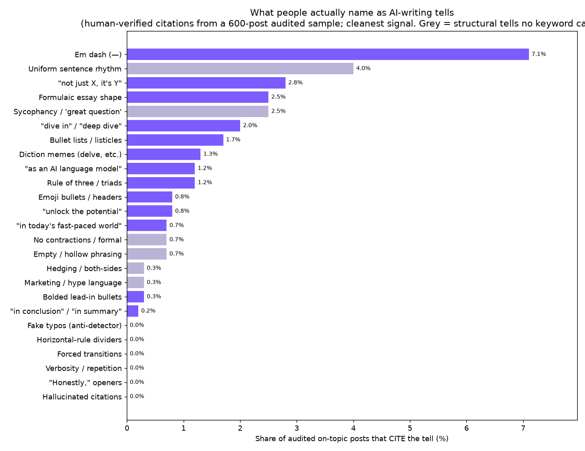
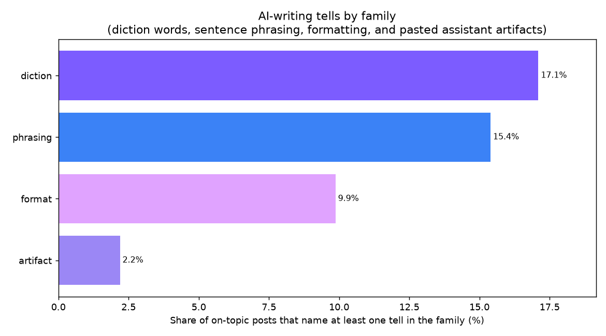
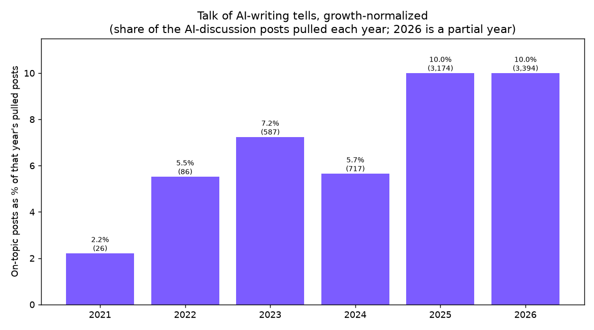
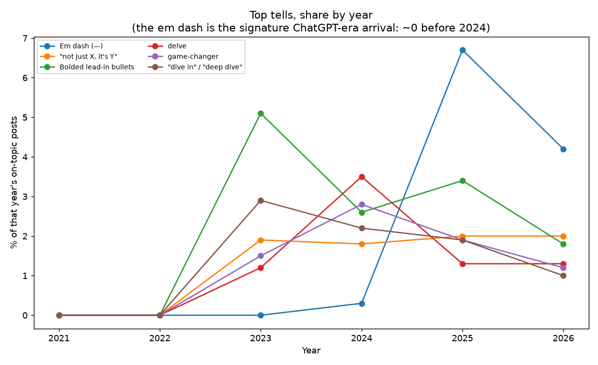

# What makes text look AI-written: the data

This folder is the full dataset and code behind a Reddit post that ranks the tells
people actually use to spot AI-written **text** (prose, marketing, academic writing,
not AI code, not AI design). It mines public Reddit discussion from the free
[Arctic Shift](https://arctic-shift.photon-reddit.com) archive, tabulates which
writing tells get named most, and verifies the top findings against real quotes.

Reproducible with Python and the standard library, plus matplotlib for charts and an
LLM pass for the citation audit. No API key for the data (Arctic Shift is open).

## The numbers

- **89,239 posts pulled**, **7,984 on-topic** (genuinely about spotting AI writing),
  across **47 subreddits**, 2021 to 2026.
- **Three lanes, on purpose:** AI tools (r/ChatGPT, r/ClaudeAI, r/OpenAI, r/LocalLLaMA,
  ...), writing and craft (r/WritingWithAI, r/Professors, r/Teachers, r/copywriting,
  r/Blogging, ...), and SaaS / indie (r/SaaS, r/SideProject, r/microsaas, ...).
- **Two lenses.** Lens 1 is the share of on-topic posts whose text matches each tell.
  Lens 2 is the AI-context airtime of the distinctive terms queried directly, and across
  how many subreddits each one shows up.
- **A 600-post sample was hand-audited** to record what people actually *cite* as a
  tell, versus what a keyword pass merely matches. The two diverge sharply, and the
  cited number is treated as the primary ranking.

## Headline finding

The loudest thing people report is a gut feeling: the writing "sounds like ChatGPT,"
it has a recognizable cadence, it says nothing at length. The one concrete, nameable
tell that beats everything else is the **em dash**. Right behind it sit the tells no
keyword scanner can catch, a flat sentence rhythm and the reflexive yes-man positivity,
which the audited readers name about as often.



A keyword pass gets this backwards: it over-counts ordinary words (`however`, `nuanced`,
`comprehensive`) that nobody actually cites, and it is blind to the structural tells that
rank highest. Rolled up by family, diction and phrasing lead, formatting and pasted
assistant artifacts trail.



## Why now

The conversation barely existed before 2023, then climbed steadily. The em dash is the
cleanest before-and-after: essentially absent from the on-topic posts before 2024, then
the single most-cited tell.





## The skill

The findings are packaged as `unslop-text`, a Claude skill that strips these patterns
while writing or auditing prose. It does not write the piece for you and it has no house
style. It removes the cited tells and warns against the over-corrected "trying not to
sound like AI" register that just swaps one default for another. It includes a standalone
scanner (`skill/scripts/unslop_text_scan.py`) that flags the mechanical tells in prose
with severity weighted by the data shares, prints a slop score, and gates CI on the exit
code. See [skill/README.md](skill/README.md) to install it or run the scanner.

## How to reproduce

Run in order. The harvester is sequential and resumable (it checkpoints and dedupes by
id) because the Arctic Shift throttle is sticky.

```bash
pip install matplotlib

python3 collect.py             # harvest on-topic post text -> corpus_raw.jsonl
python3 analyze.py             # Lens 1 + Lens 2 tables, corpus_stats, quote bank, audit chunks
# the citation audit (extract_workflow.js) reads the chunks and writes extract_result.json
python3 compare.py             # cited-vs-keyword per tell -> comparison.csv
python3 build_verified_tally.py  # join the audited ranking to the regex shares -> verified_tally.csv
python3 make_charts.py         # the cited ranking + the regex-vs-cited comparison
python3 make_charts2.py        # scale, growth, trend, funnel, concentration, co-occurrence, family, threads, lens 2
```

The raw corpus is not committed (see `DATA_NOTE.md`); regenerate it with `collect.py`.

## What is in here

- **Scripts:** `collect.py`, `analyze.py` (the lexicon and the on-topic filter),
  `compare.py`, `build_verified_tally.py`, `gen_synthesis.py`, `make_charts.py`,
  `make_charts2.py`, `extract_workflow.js` (the multi-agent citation audit).
- **Tables:** `findings_lens1.csv` and `findings_lens2.csv` (the two lenses),
  `comparison.csv` and `verified_tally.csv` (the audit vs the keyword pass),
  `human_only_tells.csv`, `detTop.txt`, `corpus_stats.txt`.
- **Quote bank:** `quote_bank.txt` (verbatim, top-scored on-topic posts and per-tell
  candidates; no usernames).
- **Charts:** thirteen PNGs (see the chart index below).
- **Skill:** `skill/`, the packaged `unslop-text` Claude skill.

### Charts

`chart_tells_cited.png` (the verified, cited ranking), `chart_regex_vs_cited.png`,
`chart_tells_ranked.png` (the keyword pass), `chart_growth.png`, `chart_tell_trend.png`,
`chart_scanned_by_sub.png`, `chart_raw_counts_by_tell.png`, `chart_funnel.png`,
`chart_concentration.png`, `chart_cooccurrence.png`, `chart_by_category.png`,
`chart_top_threads.png`, `chart_lens2_terms.png`.

## Method and caveats

Share of posts, not raw counts, because the topic barely existed before 2023 and raw
counts mostly track the subreddits growing. The keyword pass over-counts ordinary words
that people write normally, so the hand-audited citation column drives the ranking, not
the keyword column. Several of the most-cited tells (uniform rhythm, sycophancy, saying
nothing at length) are structural and cannot be detected by a regex at all; they are
documented for a human pass. This is a proxy for vocal, online opinion, so trust the
relative ordering more than the exact percentages.

## License and data

Code follows the repo `LICENSE`. The harvested text is public Reddit content collected
via Arctic Shift and belongs to its original authors; the raw corpus is not committed
(see `DATA_NOTE.md`).
